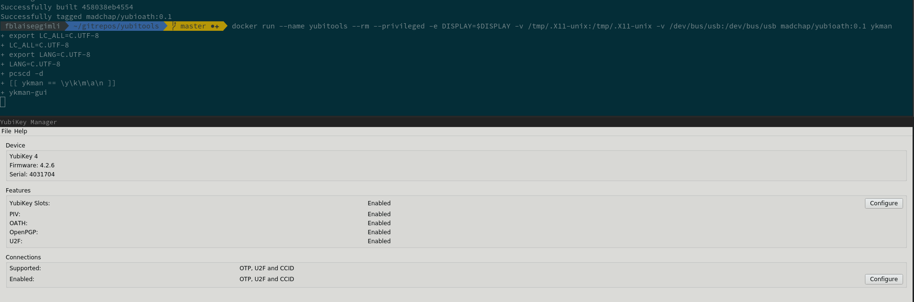
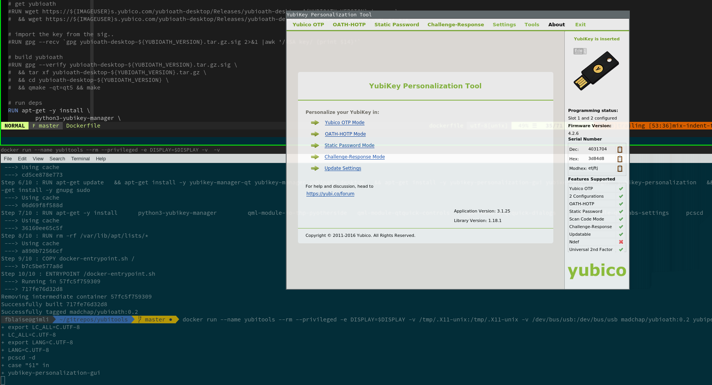

# yubitools
Yubioath, ykman and others

## Available
* yubikey manager (CLI and QT)
* yubioath-desktop
* Personalization tool
* PIV Manager

## How to run

Invoking the container with no argument will show the help.

Usage:
```
docker run --name yubitools --rm \
	--privileged \
	-e DISPLAY=$DISPLAY \
	-v /tmp/.X11-unix:/tmp/.X11-unix \
	-v /dev/bus/usb:/dev/bus/usb \
	madchap/yubitools:latest <COMMAND>

	where <COMMAND> can be:
	- ykman		: will launch the yubikey manager UI.
	- ykman-cli 	: will launch the yubikey manager CLI. You want to pass your program parameters too.
	- yubioath 	: will launch the yubioath desktop UI.
	- yubipiv	: will launch the yubikey PIV manager UI.
	- yubipiv-cli	: will launch the yubikey PIV manager CLI. You want to pass your program parameters too.
	- yubiperso	: will launch the yubikey personalization UI.
	- yubiperso-cli	: will launch the yubikey personalization CLI. You want to pass your program parameters too.
```

Example:
```
docker run --name yubitools --rm --privileged -e DISPLAY=$DISPLAY -v /tmp/.X11-unix:/tmp/.X11-unix -v /dev/bus/usb:/dev/bus/usb madchap/yubitools:latest ykman
```

### Aliases
You could of course define some alias, to make it easier, such as the following for `yubioath-desktop`:

`alias yubioath='docker run --name yubitools --rm --privileged -e DISPLAY=$DISPLAY -v /tmp/.X11-unix:/tmp/.X11-unix -v /dev/bus/usb:/dev/bus/usb madchap/yubitools yubioath'`

## Common issues
If you have an error, such as:

```
No protocol specified
QXcbConnection: Could not connect to display :0
/docker-entrypoint.sh: line 11:    13 Aborted                 (core dumped) yubikey-personalization-gui
```

Make sure you have `xhost +local:` on your terminal to allow access to your display (you can be more restrictive than that if you wish).

## Screenshot or it did not happen

### Yubikey manager


### Yubikey personalization tool

